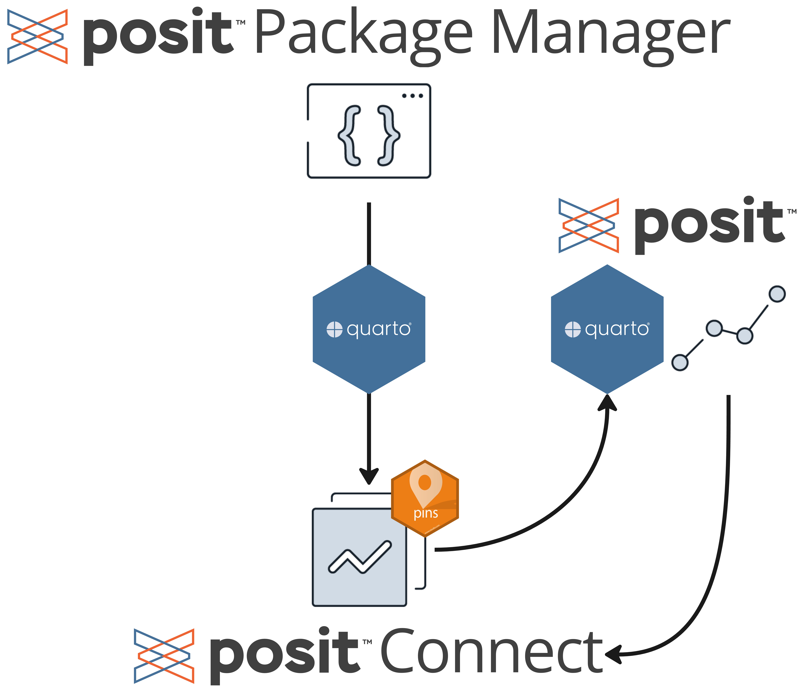

# Posit Team Demo: Quarto and Job Scheduling

{fig-align="center" width="462"}

This is the companion GitHub repository for the June 2023 Posit Team Community demo. The goal of the demo was to extract R package download data from [Posit's Public Package Manager](https://packagemanager.posit.co/client/#/) (PPPM) using an Extract-Transform-Load (ETL) Quarto script and visualize the results using a custom-themed Quarto report. Below are the key files in workflow:

-   `ETL.qmd`: The Extract-Transform-Load Quarto document. In this document, we call the PPPM API and extract package download data for three popular R package: `ggplot2`, `dplyr`, and `shiny`. The data is then cleaned and pinned to Posit Connect using the [`pins`](https://pins.rstudio.com/) package. This script was published to Posit Connect and scheduled to run daily.

-   `boring-report.qmd`: A draft Quarto report visualizing the package download results from the ETL script.

-   `posit_theme/posit_theme.qmd`: Same as the `boring-report.qmd` but with with a custom Posit-theme applied. A color palette was created using `RColorBrewer` and incorporated into a new `gt` table and the existing ggplot. This document was also published to Posit Connect and set to run daily.
